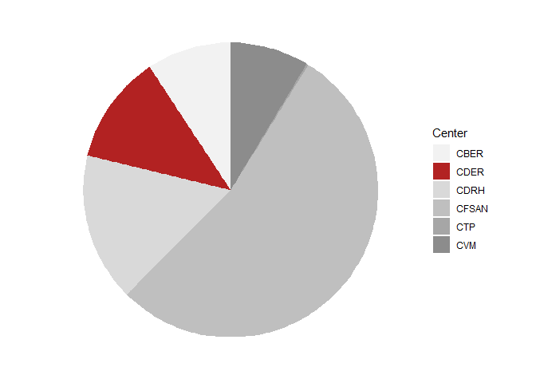

FDA Audit Analysis
================
Nick Cruickshank

``` r
library(forcats)
library(lubridate)
library(qdapRegex)
library(readr)
library(readxl)
library(tidyverse)
library(scales)
library(stringr)
library(USAboundaries)
library(usmap)
```

``` r
classifications <- read_excel("Inspection_Classification_(10-1-2008_through_7-22-2020).xlsx", 
    col_types = c("text", "text", "text", 
        "text", "text", "text", "date", "text", 
        "text", "text"))

citations <- read_excel("Inspection_Citation_(10-1-2008_through_7-22-2020)_0.xlsx", 
    col_types = c("text", "text", "text", 
        "text", "date", "text", "text", "text", 
        "text"))

drug_obs <- read_csv("fda_drug_observation.csv", 
    col_types = cols(`Cite Id` = col_character()))

list_503b <- read_csv("list_503b.csv", col_types = cols(current_outsourcing_registration_date = col_date(format = "%m/%d/%Y"), 
    date_last_inspection = col_date(format = "%m/%d/%Y"), 
    initial_outsourcing_registration_date = col_date(format = "%m/%d/%Y")))
```

``` r
Mode <- function(v) {
   uniqv <- unique(v)
   uniqv[which.max(tabulate(match(v, uniqv)))]
}
```

# Description of Datasets

## Classifications

A dataset of all project areas inspected by the FDA between 10-01-2008
and 07-22-2020 categorized by classification.

``` r
classifications %>%
  head(5)
```

    ## # A tibble: 5 x 10
    ##   District `Legal Name` City  State Zip   `Country/Area` `Inspection End Da~
    ##   <chr>    <chr>        <chr> <chr> <chr> <chr>          <dttm>             
    ## 1 ATL      Mckesson Dr~ Dulu~ GA    3009~ US             2008-10-01 00:00:00
    ## 2 ATL      Morehouse S~ Atla~ GA    3031~ US             2008-10-01 00:00:00
    ## 3 ATL      Bland, Andr~ Dalt~ GA    3072~ US             2008-10-09 00:00:00
    ## 4 ATL      Littlejohn ~ Wins~ NC    2710~ US             2008-10-10 00:00:00
    ## 5 ATL      Custom Mill~ Davi~ GA    31018 US             2008-10-14 00:00:00
    ## # ... with 3 more variables: Center <chr>, `Project Area` <chr>,
    ## #   Classification <chr>

Source:
<https://www.fda.gov/inspections-compliance-enforcement-and-criminal-investigations/inspection-classification-database>
Info on Columns:
<https://www.accessdata.fda.gov/scripts/inspsearch/searchfields.cfm> Key
for Districts:
<https://www.fda.gov/inspections-compliance-enforcement-and-criminal-investigations/compliance-actions-and-activities/district-names-and-abbreviations>

| No. | Column Name         | Class | Description                                                 |
| --- | ------------------- | ----- | ----------------------------------------------------------- |
| 01  | District            | chr   | District where company resides                              |
| 02  | Legal Name          | chr   | Name of the company inspected.                              |
| 03  | City                | chr   | City the company is located in.                             |
| 04  | State               | chr   | Abbreviation for the state the company is located in        |
| 05  | Zip                 | chr   | Zip code for company address                                |
| 06  | County/Area         | chr   | State the company is based in.                              |
| 07  | Inspection End Date | date  | Date the inspection was concluded                           |
| 08  | Center              | chr   | Sub-department of the FDA.                                  |
| 09  | Project Area        | chr   | Categorized by corresponding center.                        |
| 10  | Classification      | chr   | Inspection classification with regards to compliance status |

Centers include the following: - CFSAN: Center for Food Safety and
Applied Nutrition - CBER: Center for Biologics Evaluation and Research -
CDER: Center for Drug Evaluation and Radiological Health - CVM: Center
for Veterinary Medicine - CDRH: Office of Regulatory Affairs - CTP:
Center for Tobacco Product(s)

Classifications include the following: - NAI: No Action Indicated - VAI:
Voluntary Action Indicated - OAI: Official Action Indicated

## Citations

Source:
<https://www.fda.gov/inspections-compliance-enforcement-and-criminal-investigations/inspection-references/inspection-citation>

A data set of all citations given by the FDA during audits generated
from FDA Form 483 between 10-01-2008 and 07-22-2008.

``` r
citations %>%
  head(5)
```

    ## # A tibble: 5 x 9
    ##   `Firm Name` City  State `Country/Area` `Inspection End Da~ `Program Area`
    ##   <chr>       <chr> <chr> <chr>          <dttm>              <chr>         
    ## 1 A & M Bake~ Clar~ WV    United States  2008-10-01 00:00:00 Foods         
    ## 2 A & M Bake~ Clar~ WV    United States  2008-10-01 00:00:00 Foods         
    ## 3 A & M Bake~ Clar~ WV    United States  2008-10-01 00:00:00 Foods         
    ## 4 A & M Bake~ Clar~ WV    United States  2008-10-01 00:00:00 Foods         
    ## 5 A & M Bake~ Clar~ WV    United States  2008-10-01 00:00:00 Foods         
    ## # ... with 3 more variables: `CFR/Act Number` <chr>, `Short Description` <chr>,
    ## #   `Long Description` <chr>

## List of 503B Outsourcing Pharmaceutical Companies

Source:
<https://www.fda.gov/drugs/human-drug-compounding/registered-outsourcing-facilities>

``` r
list_503b %>%
  head()
```

    ## # A tibble: 6 x 7
    ##   `Facility Name` initial_outsour~ current_outsour~ date_last_inspe~
    ##   <chr>           <date>           <date>           <date>          
    ## 1 Advanced Pharm~ 2019-02-26       2019-11-18       NA              
    ## 2 AnazaoHealth C~ 2014-09-23       2019-10-22       2019-09-19      
    ## 3 Apollo Care, C~ 2017-09-14       2019-12-11       2018-03-13      
    ## 4 AptiPharma, LL~ 2020-02-07       2020-02-07       NA              
    ## 5 ASP CARES, San~ 2017-02-14       2019-12-03       2018-08-23      
    ## 6 Athenex Pharma~ 2017-04-10       2019-10-25       2019-08-28      
    ## # ... with 3 more variables: form483_issued <chr>, other_action <chr>,
    ## #   intent_to_compound_from_bulk_drug_substance <chr>

## Drug Observations

A section of the Inspections Observations data sheet strictly related to
Drug Products. Lists the frequency of all given observations.

``` r
drug_obs %>%
  head()
```

    ## # A tibble: 6 x 6
    ##   `Citation Progr~ `Cite Id` `Reference Numb~ `Short Descript~ `Long Descripti~
    ##   <chr>            <chr>     <chr>            <chr>            <chr>           
    ## 1 Drugs            1105      21 CFR 211.22(d) Procedures not ~ The responsibil~
    ## 2 Drugs            2027      21 CFR 211.192   Investigations ~ There is a fail~
    ## 3 Drugs            3603      21 CFR 211.160(~ Scientifically ~ Laboratory cont~
    ## 4 Drugs            1361      21 CFR 211.100(~ Absence of Writ~ There are no wr~
    ## 5 Drugs            1213      21 CFR 211.67(a) Cleaning / Sani~ Equipment and u~
    ## 6 Drugs            1883      21 CFR 211.165(~ Testing and rel~ Testing and rel~
    ## # ... with 1 more variable: Frequency <dbl>

Source:
<https://www.fda.gov/inspections-compliance-enforcement-and-criminal-investigations/inspection-references/inspection-observations>
More Info:
<https://www.fda.gov/inspections-compliance-enforcement-and-criminal-investigations/inspection-references/inspectional-observations-and-citations>

## US Population

``` r
us_pop <- read_excel("us_pop.xlsx")
```

Source:
<https://en.wikipedia.org/wiki/List_of_states_and_territories_of_the_United_States_by_population>

# Exploratory Analysis

Proportion of total inspections performed by the Center for Drug
Evaluation and Radiological Health (CDER).

``` r
blank_theme <- theme_minimal() + 
  theme(
    axis.title.x = element_blank(),
    axis.title.y = element_blank(),
    panel.border = element_blank(),
    panel.grid = element_blank(),
    axis.ticks = element_blank(),
    plot.title = element_text(size = 14, face = "bold")
  )

classifications %>%
  group_by(Center) %>%
  dplyr::summarise(
    Inspections = n()
  ) %>%
  ggplot() + 
  geom_bar(aes(x = "", y = Inspections, fill = Center), stat = "identity") + 
  scale_fill_manual(values = c(
    "CBER" = "grey95",
    "CDER" = "firebrick",
    "CDRH" = "grey85",
    "CFSAN" = "grey75",
    "CTP" = "grey65",
    "CVM" = "grey55"
  )) + 
  coord_polar("y", start = 0) + 
  theme_minimal() + 
  blank_theme +
  theme(axis.text.x = element_blank())
```

<!-- -->

## Monthly Distribution of FDA Audits

``` r
classifications %>%
  filter(Center == "CDER",
         `Project Area` == "Drug Quality Assurance",
         !is.na(State),
         District == "NWE") %>%
  separate(`Inspection End Date`, into = c("year", "month", "day"), sep = "-", remove = FALSE) %>%
  group_by(month) %>%
  dplyr::summarise(
    count = n(),
    NAI = sum(Classification == "NAI"),
    VAI = sum(Classification == "VAI"),
    OAI = sum(Classification == "OAI"),
  ) %>%
  mutate(month_abr = case_when(
    month == "01" ~ "Jan",
    month == "02" ~ "Feb",
    month == "03" ~ "Mar",
    month == "04" ~ "Apr",
    month == "05" ~ "May",
    month == "06" ~ "Jun",
    month == "07" ~ "Jul",
    month == "08" ~ "Aug",
    month == "09" ~ "Sep",
    month == "10" ~ "Oct",
    month == "11" ~ "Nov",
    month == "12" ~ "Dec"
  )) %>%
  pivot_longer(cols = c(NAI, VAI, OAI), names_to = "Classification", values_to = "Inspections") %>%
  mutate(class_sev = case_when(
    Classification == "NAI" ~ 1,
    Classification == "VAI" ~ 2,
    Classification == "OAI" ~ 3)) %>%
  rename(c(
    "m1" = "month",
    "Month" = "month_abr"
  )) %>%
  ggplot(aes(fct_reorder(Month, m1), Inspections)) + 
  geom_bar(aes(fill = fct_reorder(Classification, desc(class_sev))), stat = "identity") + 
  scale_fill_brewer(palette = "YlOrRd", direction = -1) + 
  labs(
    title = "FDA Audits in the New England Area are less frequent in the summer",
    subtitle = "Classification of 'Offical Action Indicated' most common in March and August",
    x = "Month",
    y = "Number of Inspections",
    fill = "Classification",
    caption = "Source: fda.gov"
  ) + 
  theme_bw() + 
  theme(
    legend.position = "bottom"
  )
```

<!-- -->

## Most Frequent FDA Citations

``` r
# tidy list_503b
tidy_503b <- list_503b %>%
  mutate(facility = gsub("[,]? (LLC|Inc)[\\.]?[,]?", ",", `Facility Name`)) %>%
  mutate(facility = gsub("[,]? (formerly|dba|DBA|d/b/a|dba:) ", " formerly ", facility)) %>%
  mutate(facility = gsub("355 Riverwalk Pkwy, ", "", facility)) %>%
  mutate(facility = gsub(", ((NSCC)), ", "", facility)) %>%
  separate(facility, into = c("name", "city", "state"), sep = ", ", remove = FALSE) %>%
  filter(!is.na(state),
         city != "(NSCC)",
         name != "STERRX") %>%
  separate(name, into = c("Current Name", "Formerly Name"), sep = " formerly ", remove = TRUE) %>%
  mutate(`Formerly Name` = gsub("registered as ", "", `Formerly Name`)) %>%
  separate(`Formerly Name`, into = c("Former Name", "c1", "s1"), sep = ", ", remove = FALSE) %>%
  select(`Current Name`, `Former Name`, city, state, initial_outsourcing_registration_date, current_outsourcing_registration_date,
         date_last_inspection, form483_issued, other_action, intent_to_compound_from_bulk_drug_substance) %>%
  rename(c(
    #"Facility Name" = "Current Name",
    "City" = "city",
    "State" = "state"
  )) %>%
  pivot_longer(cols = c("Current Name", "Former Name"), names_to = "Name Status", values_to = "Facility Name")

tidy_503b <- tidy_503b[complete.cases(tidy_503b), ]
tidy_503b$`Compounding Outsourcing Facility` = "Yes"
tidy_503b$State <- trimws(tidy_503b$State, which = "both")

cite_503b <- citations %>%
  filter(`Program Area` == "Drugs") %>%
  mutate(fac = gsub("[,]? (LLC|Inc\\.|Lp|Ltd|Llc|LTD|LP|PLC|)[\\.]?", " ", `Firm Name`)) %>% # remove LLC or Inc from Firm Name
  mutate(fac = trimws(fac, which = "right")) %>%
  separate(fac, into = c("Current Name", "Former Name"), sep = "\\s(DBA|dba|d/b/a)\\s", remove = FALSE) %>%
  mutate(`Current Name` = trimws(`Current Name`, which = "right")) %>%
  pivot_longer(cols = c("Current Name", "Former Name"), names_to = "Name Status", values_to = "Facility Name") %>%
  merge(tidy_503b, by = c("Facility Name", "City", "State")) %>%
  select(`Facility Name`, City, State, `Country/Area`, `Inspection End Date`, `Program Area`,
         `CFR/Act Number`, `Short Description`, `Long Description`, `Name Status.x`,
         initial_outsourcing_registration_date, current_outsourcing_registration_date, date_last_inspection,
         form483_issued, other_action, intent_to_compound_from_bulk_drug_substance)

true_503B <- citations %>%
  filter(`Program Area` == "Drugs",
         `Country/Area` == "United States") %>%
  mutate(fac = gsub("[,]? (LLC|Inc\\.|Lp|Ltd|Llc|LTD|LP|PLC|)[\\.]?", " ", `Firm Name`)) %>% # remove LLC or Inc from Firm Name
  mutate(fac = trimws(fac, which = "right")) %>%
  separate(fac, into = c("Current Name", "Former Name"), sep = "\\s(DBA|dba|d/b/a)\\s", remove = FALSE) %>%
  mutate(`Current Name` = trimws(`Current Name`, which = "right")) %>%
  pivot_longer(cols = c("Current Name", "Former Name"), names_to = "Name Status", values_to = "Facility Name") %>%
  semi_join(tidy_503b, by = c("Facility Name", "City", "State")) %>%
  select(`Facility Name`, City, State, `Country/Area`, `Inspection End Date`, `Program Area`,
         `CFR/Act Number`, `Short Description`, `Long Description`)

true_503B$`Compounding Outsourcing Facility` = 1

false_503B <- citations %>%
  filter(`Program Area` == "Drugs",
         `Country/Area` == "United States") %>%
  mutate(fac = gsub("[,]? (LLC|Inc\\.|Lp|Ltd|Llc|LTD|LP|PLC|)[\\.]?", " ", `Firm Name`)) %>% # remove LLC or Inc from Firm Name
  mutate(fac = trimws(fac, which = "right")) %>%
  separate(fac, into = c("Current Name", "Former Name"), sep = "\\s(DBA|dba|d/b/a)\\s", remove = FALSE) %>%
  mutate(`Current Name` = trimws(`Current Name`, which = "right")) %>%
  pivot_longer(cols = c("Current Name", "Former Name"), names_to = "Name Status", values_to = "Facility Name") %>%
  anti_join(tidy_503b, by = c("Facility Name", "City", "State")) %>%
  select(`Facility Name`, City, State, `Country/Area`, `Inspection End Date`, `Program Area`,
         `CFR/Act Number`, `Short Description`, `Long Description`)

false_503B <- false_503B[complete.cases(false_503B), ]
false_503B$`Compounding Outsourcing Facility` = 0

tidy_citations <- rbind(true_503B, false_503B) %>%
  mutate(CFR = str_extract(`CFR/Act Number`, "21 CFR [0-9]{2,3}.[0-9]+"))

tidy_citations <- tidy_citations[complete.cases(tidy_citations), ]
```

### In Pharma

``` r
tidy_citations %>%
  group_by(CFR) %>%
  dplyr::summarise(
    Citations = n(),
    Description = Mode(`Short Description`)
  ) %>%
  head(10) %>%
  ggplot(aes(fct_reorder(Description, Citations), Citations)) + 
  geom_bar(stat = "identity", fill = "navyblue") + 
  geom_text(aes(label = CFR), hjust = "bottom", size = 3) + 
  coord_flip(ylim = c(0,2350)) + 
  labs(
    title = "Most Common 21 CFR 211 Breaches in Pharma",
    x = "Short Description of Citation",
    y = "Number of Citations",
    caption = "Source: fda.gov/inspections-compliance-enforcement-and-criminal-investigations/\n
    Data compiled from FDA Audits from October 2008 until July 2020."
  ) + 
  theme_light() + 
  theme(
    plot.title = element_text(hjust = 10)
  )
```

<!-- -->

### In 503B Pharmaceutical Outsourcing Facilities

``` r
tidy_citations %>%
  filter(`Compounding Outsourcing Facility` == 1) %>%
  group_by(CFR) %>%
  dplyr::summarise(
    Citations = n(),
    Description = Mode(`Short Description`)
  ) %>%
  head(10) %>%
  ggplot(aes(fct_reorder(Description, Citations), Citations)) + 
  geom_bar(stat = "identity", fill = "navyblue") + 
  geom_text(aes(label = CFR), hjust = "bottom", size = 3) + 
  coord_flip(ylim = c(0,45)) + 
  labs(
    title = "Most Common Breaches in 21 CFR 211",
    subtitle = "At 503B Pharmaceutical Outsourcing Facilities",
    x = "Short Description of Citation",
    y = "Number of Citations",
    caption = "Source: fda.gov/inspections-compliance-enforcement-and-criminal-investigations/"
  ) + 
  theme_light() + 
  theme(
    plot.title = element_text(hjust = -3.3),
    plot.subtitle = element_text(hjust = -2.75)
  )
```

<!-- -->

What elements of drug manufacturing are the FDA most concerned about? -
Perform text mining of all Long Descriptions. - Come up with a list of
categories which appear most frequently in the corpus. - End with a
graph of the Top X most frequently appearing words / terms, as well as
their associated guidance. - Perhaps do some machine learning on the
Long Description corpus to be able to associate a citation with a piece
of CFR.

## Citation Heatmaps

### Location of 503B Pharmaceutical Companies

``` r
pop <- us_pop %>%
  rename(c(
    "state_name" = "State"
  )) %>%
  left_join(state_codes, by = "state_name")

states_503b <- tidy_503b %>%
  select(`Facility Name`, City, State) %>%
  rename(c(
    "state_abbr" = "State"
  )) %>%
  group_by(state_abbr) %>%
  dplyr::summarise(
    Facilities = n()
  ) %>%
  left_join(pop) %>%
  rename(c(
    "state" = "state_name"
  )) %>%
  mutate(facilities_per_capita = (Facilities / Population))
```

    ## Joining, by = "state_abbr"

``` r
plot_usmap(data = states_503b, values = "facilities_per_capita", color = "black") + 
  scale_fill_viridis_c(option = "viridis", name = "Companies\nPer Capita", label = scales::comma) + 
  labs(
    title = "Distribution of 503B Pharmaceutical Compancies per capita",
    subtitle = "VT has the most per capita, although that is only one company (Edge Pharma)."
    ) + 
  theme(
    panel.background = element_rect(color = "black", fill = "lightblue"),
    legend.position = "right",
    legend.key.height = unit(2.3, "cm"),
    legend.text = element_blank()
    )
```

<!-- -->

Which states have the most citations per number of facilities in that
state? How about per capita?
