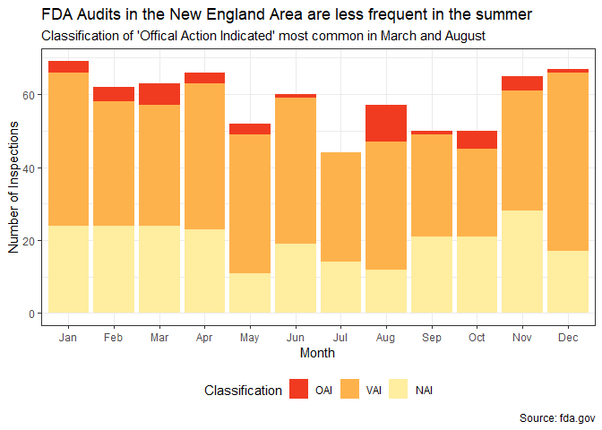

Most Frequent FDA Drug Citations
================
Nick Cruickshank

``` r
# load libraries
library(forcats)
library(lubridate)
library(qdapRegex)
library(readr)
library(readxl)
library(tidyverse)
library(scales)
library(stringr)
library(USAboundaries)
library(usmap)
```

``` r
# load data
audits <- read_excel("Inspection_Classification_(10-1-2008_through_7-22-2020).xlsx", 
    col_types = c("text", "text", "text", 
        "text", "text", "text", "date", "text", 
        "text", "text"))

citations <- read_excel("Inspection_Citation_(10-1-2008_through_7-22-2020)_0.xlsx", 
    col_types = c("text", "text", "text", 
        "text", "date", "text", "text", "text", 
        "text"))

drug_obs <- read_csv("fda_drug_observation.csv", 
    col_types = cols(`Cite Id` = col_character()))

list_503b <- read_csv("list_503b.csv", col_types = cols(current_outsourcing_registration_date
                                                        = col_date(format = "%m/%d/%Y"), 
    date_last_inspection = col_date(format = "%m/%d/%Y"), 
    initial_outsourcing_registration_date = col_date(format = "%m/%d/%Y")))
```

``` r
# create functions
Mode <- function(v) {
   uniqv <- unique(v)
   uniqv[which.max(tabulate(match(v, uniqv)))]
}
```

# Description of Data Sets

The following data sets were used to evaluate audit and citations
patterns from the FDA for drug companies in the United States. All data
sets were gathered from fda.gov, which documents each citation and/or
audit from 2008 onward. These data sets do not represent 100% of all
audits performed or citations given, but they do serve to highlight
potential trends in the FDA.

## Audits

Source:
<https://www.fda.gov/inspections-compliance-enforcement-and-criminal-investigations/inspection-classification-database>  
Info on Columns:
<https://www.accessdata.fda.gov/scripts/inspsearch/searchfields.cfm>  
Key for Districts:
<https://www.fda.gov/inspections-compliance-enforcement-and-criminal-investigations/compliance-actions-and-activities/district-names-and-abbreviations>

A data set of all project areas inspected by the FDA between 10-01-2008
and 07-22-2020 categorized by classification, where the possible
classifications are as follows: No Action Indicated (NAI), Voluntary
Action Indicated (VAI), and Official Action Indicated (OAI). Each row of
the data set represents a different functional area inspected within the
company. Therefore, the same company may appear more than once during
the same Inspection End Date. Further note that not all inspection data
is represented here, as data is only posted once final enforcement
action has been taken.

| No. | Column Name         | Class | Description                                                 |
| --- | ------------------- | ----- | ----------------------------------------------------------- |
| 01  | District            | chr   | District where company resides                              |
| 02  | Legal Name          | chr   | Name of the company inspected.                              |
| 03  | City                | chr   | City the company is located in.                             |
| 04  | State               | chr   | Abbreviation for the state the company is located in        |
| 05  | Zip                 | chr   | Zip code for company address                                |
| 06  | County/Area         | chr   | State the company is based in.                              |
| 07  | Inspection End Date | date  | Date the inspection was concluded                           |
| 08  | Center              | chr   | Sub-department of the FDA.                                  |
| 09  | Project Area        | chr   | Categorized by corresponding center.                        |
| 10  | Classification      | chr   | Inspection classification with regards to compliance status |

``` r
# preview audits df
knitr::kable(head(audits))
```

| District | Legal Name                           | City          | State | Zip        | Country/Area | Inspection End Date | Center | Project Area                                           | Classification |
| :------- | :----------------------------------- | :------------ | :---- | :--------- | :----------- | :------------------ | :----- | :----------------------------------------------------- | :------------- |
| ATL      | Mckesson Drug Company                | Duluth        | GA    | 30096-5843 | US           | 2008-10-01          | CDER   | Drug Quality Assurance                                 | VAI            |
| ATL      | Morehouse School Of Medicine-IRB     | Atlanta       | GA    | 30310-1458 | US           | 2008-10-01          | CDER   | Bioresearch Monitoring                                 | NAI            |
| ATL      | Bland, Andrew, M.D.                  | Dalton        | GA    | 30720-2529 | US           | 2008-10-09          | CDER   | Bioresearch Monitoring                                 | NAI            |
| ATL      | Littlejohn Iii Thomas W              | Winston Salem | NC    | 27103-3914 | US           | 2008-10-10          | CDER   | Bioresearch Monitoring                                 | NAI            |
| ATL      | Custom Milling Inc                   | Davisboro     | GA    | 31018      | US           | 2008-10-14          | CVM    | Monitoring of Marketed Animal Drugs, Feed, and Devices | NAI            |
| ATL      | Fertility Technology Resources, Inc. | Murphy        | NC    | 28906-6846 | US           | 2008-10-16          | CDRH   | Compliance: Devices                                    | VAI            |

``` r
# dimensions of the audit df (rows, columns)
dim(audits)
```

    ## [1] 243714     10

Centers include the following:  
\- CFSAN: Center for Food Safety and Applied Nutrition  
\- CBER: Center for Biologics Evaluation and Research  
\- CDER: Center for Drug Evaluation and Radiological Health  
\- CVM: Center for Veterinary Medicine  
\- CDRH: Office of Regulatory Affairs  
\- CTP: Center for Tobacco Product(s)

## Citations

Source:
<https://www.fda.gov/inspections-compliance-enforcement-and-criminal-investigations/inspection-references/inspection-citation>

A data set of all citations given by the FDA during audits generated
from FDA Form 483 between 10-01-2008 and 07-22-2008. This is the primary
data set of interest for this analysis, as it outlines each of the
citations given by the FDA during each audit described in the ‘audits’
df. This includes a short description, long description, and CFR/Act
Number which the firm was in breach of during the inspection.

| No. | Column Name         | Class | Description                                                            |
| --- | ------------------- | ----- | ---------------------------------------------------------------------- |
| 01  | Firm Name           | chr   | Name of firm inspected                                                 |
| 02  | City                | chr   | City firm is located in                                                |
| 03  | State               | chr   | State firm is located in                                               |
| 04  | Country/Area        | chr   | Country firm is located in                                             |
| 05  | Inspection End Date | date  | Date the inspection was concluded                                      |
| 06  | Program Area        | chr   | Branch of the FDA performing the inspection                            |
| 07  | CFR/Act Number      | chr   | Code of Federal Regulation (CFR) the firm was found to be in breach of |
| 08  | Short Description   | chr   | Abbreviated description of citation                                    |
| 09  | Long Description    | chr   | Longer description of citation (doesn’t include specifics)             |

``` r
# preview citations df
knitr::kable(head(citations))
```

| Firm Name          | City       | State | Country/Area  | Inspection End Date | Program Area | CFR/Act Number      | Short Description                  | Long Description                                                                                                                                                                                              |
| :----------------- | :--------- | :---- | :------------ | :------------------ | :----------- | :------------------ | :--------------------------------- | :------------------------------------------------------------------------------------------------------------------------------------------------------------------------------------------------------------ |
| A & M Bakery, Inc. | Clarksburg | WV    | United States | 2008-10-01          | Foods        | 21 CFR 110.20(b)(4) | Floors, walls and ceilings         | The plant is not constructed in such a manner as to allow ceilings to be adequately cleaned and kept clean.                                                                                                   |
| A & M Bakery, Inc. | Clarksburg | WV    | United States | 2008-10-01          | Foods        | 21 CFR 110.20(b)(5) | Safety lighting and glass          | Failure to provide safety-type lighting fixtures suspended over exposed food.                                                                                                                                 |
| A & M Bakery, Inc. | Clarksburg | WV    | United States | 2008-10-01          | Foods        | 21 CFR 110.35(a)    | Buildings/good repair              | Failure to maintain buildings in repair sufficient to prevent food from becoming adulterated.                                                                                                                 |
| A & M Bakery, Inc. | Clarksburg | WV    | United States | 2008-10-01          | Foods        | 21 CFR 110.35(a)    | Cleaning and sanitizing operations | Failure to conduct cleaning and sanitizing operations for utensils and equipment in a manner that protects against contamination of food.                                                                     |
| A & M Bakery, Inc. | Clarksburg | WV    | United States | 2008-10-01          | Foods        | 21 CFR 110.80(a)(1) | Storage                            | Failure to store raw materials in a manner that protects against contamination.                                                                                                                               |
| A & M Bakery, Inc. | Clarksburg | WV    | United States | 2008-10-01          | Foods        | 21 CFR 110.20(a)(1) | Harborage areas                    | Failure to remove litter and waste and cut weeds or grass that may constitute an attractant, breeding place, or harborage area for pests, within the immediate vicinity of the plant buildings or structures. |

``` r
# dimensions of the citations df (rows, columns)
dim(citations)
```

    ## [1] 216566      9

## List of 503B Outsourcing Pharmaceutical Companies

Source:
<https://www.fda.gov/drugs/human-drug-compounding/registered-outsourcing-facilities>

One limitation of the ‘citations’ df is that it does not define which
subcategory of the drug manufacturing industry the firm belongs to.
Specifically, companies like Edge Pharma belong to a division of human
drug compounding outsourcing facilities under Section 503B of the
Federal Food, Drug, and Cosmetic Act (hereafter simply referred to as a
503B company). These companies are often held to very strict standards
by the FDA, and are likely to be subject to a slight variation in where
elements of the company the FDA pays attention to. Therefore, the list
of currently registered outsourcing facilities was pulled from fda.gov
in order to amend the ‘citations’ df to include an additional Boolean
column to answer the question “is the company a 503B?”

Of note, there are only 73 companies currently registers as 503B
companies with the FDA, with some of those not yet inspected.
Additionally, the naming format for the list of 503B companies is
noticeably different than in the ‘citations’ df (for one thing, the
Facility Name includes city and state). Another complication is that the
data frame only includes *current* 503B companies, which means that
there may be some companies missing from the list whom the FDA shut down
between 2008 and now. Despite the limitations, the list of 503B’s does
provide for minor discrepancies between drug program area citations at
large and 503B companies in particular to be detected.

| No. | Column Name                                       | Class | Description                                                                         |
| --- | ------------------------------------------------- | ----- | ----------------------------------------------------------------------------------- |
| 01  | Facility Name                                     | chr   | Name of 503B facility                                                               |
| 02  | initial\_outsourcing\_registration\_date          | date  | Date of initial outsourcing registration                                            |
| 03  | current\_outsourcing\_registration\_date          | date  | Most recent date of outsourcing registration                                        |
| 04  | date\_last\_inspection                            | date  | Most recent FDA inspection                                                          |
| 05  | form483\_issued                                   | chr   | Brief description of whether the facility would appear on the ‘citations’ df        |
| 06  | other\_action                                     | chr   | Aside from issuing Form 483, other actions taken                                    |
| 07  | intent\_to\_compound\_from\_bulk\_drug\_substance | chr   | The company intends to compound sterile drugs from bulk drug substances (yes or no) |

``` r
# preview the list_503b df
knitr::kable(head(list_503b))
```

| Facility Name                                          | initial\_outsourcing\_registration\_date | current\_outsourcing\_registration\_date | date\_last\_inspection | form483\_issued | other\_action              | intent\_to\_compound\_from\_bulk\_drug\_substance |
| :----------------------------------------------------- | :--------------------------------------- | :--------------------------------------- | :--------------------- | :-------------- | :------------------------- | :------------------------------------------------ |
| Advanced Pharmaceutical Technology, Inc., Elmsford, NY | 2019-02-26                               | 2019-11-18                               | NA                     | N/A             | N/A                        | Yes                                               |
| AnazaoHealth Corporation, Las Vegas, NV                | 2014-09-23                               | 2019-10-22                               | 2019-09-19             | Yes             | Open7                      | Yes                                               |
| Apollo Care, Columbia, MO                              | 2017-09-14                               | 2019-12-11                               | 2018-03-13             | Yes             | Warning Letter - 3/20/2019 | Yes                                               |
| AptiPharma, LLC, Loveland, CO                          | 2020-02-07                               | 2020-02-07                               | NA                     | N/A             | N/A                        | No                                                |
| ASP CARES, San Antonio, TX                             | 2017-02-14                               | 2019-12-03                               | 2018-08-23             | Yes             | Open                       | Yes                                               |
| Athenex Pharma Solutions, LLC, Clarence, NY            | 2017-04-10                               | 2019-10-25                               | 2019-08-28             | Yes             | Open7                      | Yes                                               |

``` r
# dimensions of the list_503b df (rows, columns)
dim(list_503b)
```

    ## [1] 73  7

## US Population

Source:
<https://en.wikipedia.org/wiki/List_of_states_and_territories_of_the_United_States_by_population>

Self explanatory data set. Allows for calculation of per capita rates in
the above mentioned data sets.

| No. | Column Name | Class | Description                            |
| --- | ----------- | ----- | -------------------------------------- |
| 01  | State       | chr   | Full name of state                     |
| 02  | Population  | int   | Most recent census data for that state |

``` r
us_pop <- read_excel("us_pop.xlsx")

# preview the us_pop df
knitr::kable(head(us_pop))
```

| State        | Population |
| :----------- | ---------: |
| California   |   39512223 |
| Texas        |   28995881 |
| Florida      |   21477737 |
| New York     |   19453561 |
| Pennsylvania |   12801989 |
| Illinois     |   12671821 |

# Audit Analysis

## Distribution of Audits by Center

While the primary data set of interest in this analysis is the
‘citations’ df, the ‘audits’ df does provide some brief insight into
the FDA Audit patterns. For example, it can be seen easily what
proportion of FDA audits are performed by the Center for Drug Evaluation
and Radiological Health (CDER), who would be responsible for drug
manufacturers. From the following graph, we can see that the CDER audits
surprisingly only account for a small fraction of the total audits
performed.

``` r
blank_theme <- theme_minimal() + 
  theme(
    axis.title.x = element_blank(),
    axis.title.y = element_blank(),
    panel.border = element_blank(),
    panel.grid = element_blank(),
    axis.ticks = element_blank(),
    plot.title = element_text(size = 14, face = "bold")
  )

audits %>%
  group_by(Center) %>%
  dplyr::summarise(
    Inspections = n()
  ) %>%
  ggplot() + 
  geom_bar(aes(x = "", y = Inspections, fill = Center), stat = "identity") + 
  scale_fill_manual(values = c(
    "CBER" = "grey95",
    "CDER" = "firebrick",
    "CDRH" = "grey85",
    "CFSAN" = "grey75",
    "CTP" = "grey65",
    "CVM" = "grey55"
  )) + 
  coord_polar("y", start = 0) + 
  theme_minimal() + 
  blank_theme +
  theme(axis.text.x = element_blank())
```

<!-- -->

## Monthly Distribution of FDA Audits

Another potential insight that can be gleamed from the ‘audits’ df is
predicting when the FDA will show up next for an audit. This would be an
important measure to define for drug companies, as it would allow for
management to know when to be prepared to expect another audit. For the
following visual, only audits performed by the CDER in the “Drug Quality
Assurance” project area in the Northeastern Branch of the FDA are
considered. These filters were applied as they were the most
representative of Edge Pharma’s interests. From this visual, it can be
see that there was no strong pattern in which month of the year the FDA
are most likely to perform an audit. They appear to perform the smallest
number of audits in the summer months, with the winter months
representing the highest number of audits. When looking closer at the
proportion of audits performed each month which resulted in a
classification of OAI (Official Action Needed), it appears that the
months with the greatest proportion were March and August.

``` r
audits %>%
  filter(Center == "CDER",
         `Project Area` == "Drug Quality Assurance",
         !is.na(State),
         District == "NWE") %>%
  separate(`Inspection End Date`, into = c("year", "month", "day"), sep = "-", remove = FALSE) %>%
  group_by(month) %>%
  dplyr::summarise(
    count = n(),
    NAI = sum(Classification == "NAI"),
    VAI = sum(Classification == "VAI"),
    OAI = sum(Classification == "OAI"),
  ) %>%
  mutate(month_abr = case_when(
    month == "01" ~ "Jan",
    month == "02" ~ "Feb",
    month == "03" ~ "Mar",
    month == "04" ~ "Apr",
    month == "05" ~ "May",
    month == "06" ~ "Jun",
    month == "07" ~ "Jul",
    month == "08" ~ "Aug",
    month == "09" ~ "Sep",
    month == "10" ~ "Oct",
    month == "11" ~ "Nov",
    month == "12" ~ "Dec"
  )) %>%
  pivot_longer(cols = c(NAI, VAI, OAI), names_to = "Classification", values_to = "Inspections") %>%
  mutate(class_sev = case_when(
    Classification == "NAI" ~ 1,
    Classification == "VAI" ~ 2,
    Classification == "OAI" ~ 3)) %>%
  rename(c(
    "m1" = "month",
    "Month" = "month_abr"
  )) %>%
  ggplot(aes(fct_reorder(Month, m1), Inspections)) + 
  geom_bar(aes(fill = fct_reorder(Classification, desc(class_sev))), stat = "identity") + 
  scale_fill_brewer(palette = "YlOrRd", direction = -1) + 
  labs(
    title = "FDA Audits in the New England Area are less frequent in the summer",
    subtitle = "Classification of 'Offical Action Indicated' most common in March and August",
    x = "Month",
    y = "Number of Inspections",
    fill = "Classification",
    caption = "Source: fda.gov"
  ) + 
  theme_bw() + 
  theme(
    legend.position = "bottom"
  )
```

<!-- -->

## Most Frequent FDA Citations

One of the most important insights that can be extracted from the
‘citations’ df is the most frequently occurring CFR/Act Numbers and
citations (short descriptions) which the FDA are likely to observe at a
drug manufacturing company. For Edge Pharma, and 503B companies in
general, the question needs to be further specified to just assess 503B
companies specifically. Curating the ‘citations’ df required a
surprising amount of data tidying using regular expressions, and even at
the end of the tidying when it was time to merge the ‘list\_503b’ into
‘citations’, there were still some 503b companies which did not appear
in the ‘citations’ df. This is likely due to the clause described in the
summary of the ‘audits’ df, wherein only data from audits with final
enforcement performed are included.

``` r
# tidy list_503b
tidy_503b <- list_503b %>%
  mutate(facility = gsub("[,]? (LLC|Inc)[\\.]?[,]?", ",", `Facility Name`)) %>%
  mutate(facility = gsub("[,]? (formerly|dba|DBA|d/b/a|dba:) ", " formerly ", facility)) %>%
  mutate(facility = gsub("355 Riverwalk Pkwy, ", "", facility)) %>%
  mutate(facility = gsub(", ((NSCC)), ", "", facility)) %>%
  separate(facility, into = c("name", "city", "state"), sep = ", ", remove = FALSE) %>%
  filter(!is.na(state),
         city != "(NSCC)",
         name != "STERRX") %>%
  separate(name, into = c("Current Name", "Formerly Name"), sep = " formerly ", remove = TRUE) %>%
  mutate(`Formerly Name` = gsub("registered as ", "", `Formerly Name`)) %>%
  separate(`Formerly Name`, into = c("Former Name", "c1", "s1"), sep = ", ", remove = FALSE) %>%
  select(`Current Name`, `Former Name`, city, state, initial_outsourcing_registration_date,
         current_outsourcing_registration_date, date_last_inspection, form483_issued,
         other_action, intent_to_compound_from_bulk_drug_substance) %>%
  rename(c(
    "City" = "city",
    "State" = "state"
  )) %>%
  pivot_longer(cols = c("Current Name", "Former Name"), names_to = "Name Status", values_to = "Facility Name")

tidy_503b <- tidy_503b[complete.cases(tidy_503b), ]
tidy_503b$`Compounding Outsourcing Facility` = "Yes"
tidy_503b$State <- trimws(tidy_503b$State, which = "both")

cite_503b <- citations %>%
  filter(`Program Area` == "Drugs") %>%
  # remove LLC or Inc from Firm Name
  mutate(fac = gsub("[,]? (LLC|Inc\\.|Lp|Ltd|Llc|LTD|LP|PLC|)[\\.]?", " ", `Firm Name`)) %>% 
  mutate(fac = trimws(fac, which = "right")) %>%
  separate(fac, into = c("Current Name", "Former Name"), sep = "\\s(DBA|dba|d/b/a)\\s", remove = FALSE) %>%
  mutate(`Current Name` = trimws(`Current Name`, which = "right")) %>%
  pivot_longer(cols = c("Current Name", "Former Name"), names_to = "Name Status", values_to = "Facility Name") %>%
  merge(tidy_503b, by = c("Facility Name", "City", "State")) %>%
  select(`Facility Name`, City, State, `Country/Area`, `Inspection End Date`, `Program Area`,
         `CFR/Act Number`, `Short Description`, `Long Description`, `Name Status.x`,
         initial_outsourcing_registration_date, current_outsourcing_registration_date, date_last_inspection,
         form483_issued, other_action, intent_to_compound_from_bulk_drug_substance)

true_503B <- citations %>%
  filter(`Program Area` == "Drugs",
         `Country/Area` == "United States") %>%
  # remove LLC or Inc from Firm Name
  mutate(fac = gsub("[,]? (LLC|Inc\\.|Lp|Ltd|Llc|LTD|LP|PLC|)[\\.]?", " ", `Firm Name`)) %>% 
  mutate(fac = trimws(fac, which = "right")) %>%
  separate(fac, into = c("Current Name", "Former Name"), sep = "\\s(DBA|dba|d/b/a)\\s", remove = FALSE) %>%
  mutate(`Current Name` = trimws(`Current Name`, which = "right")) %>%
  pivot_longer(cols = c("Current Name", "Former Name"), names_to = "Name Status", values_to = "Facility Name") %>%
  semi_join(tidy_503b, by = c("Facility Name", "City", "State")) %>%
  select(`Facility Name`, City, State, `Country/Area`, `Inspection End Date`, `Program Area`,
         `CFR/Act Number`, `Short Description`, `Long Description`)

true_503B$`Compounding Outsourcing Facility` = 1

false_503B <- citations %>%
  filter(`Program Area` == "Drugs",
         `Country/Area` == "United States") %>%
  # remove LLC or Inc from Firm Name
  mutate(fac = gsub("[,]? (LLC|Inc\\.|Lp|Ltd|Llc|LTD|LP|PLC|)[\\.]?", " ", `Firm Name`)) %>% 
  mutate(fac = trimws(fac, which = "right")) %>%
  separate(fac, into = c("Current Name", "Former Name"), sep = "\\s(DBA|dba|d/b/a)\\s", remove = FALSE) %>%
  mutate(`Current Name` = trimws(`Current Name`, which = "right")) %>%
  pivot_longer(cols = c("Current Name", "Former Name"), names_to = "Name Status", values_to = "Facility Name") %>%
  anti_join(tidy_503b, by = c("Facility Name", "City", "State")) %>%
  select(`Facility Name`, City, State, `Country/Area`, `Inspection End Date`, `Program Area`,
         `CFR/Act Number`, `Short Description`, `Long Description`)

false_503B <- false_503B[complete.cases(false_503B), ]
false_503B$`Compounding Outsourcing Facility` = 0

tidy_citations <- rbind(true_503B, false_503B) %>%
  mutate(CFR = str_extract(`CFR/Act Number`, "21 CFR [0-9]{2,3}.[0-9]+"))

tidy_citations <- tidy_citations[complete.cases(tidy_citations), ]
```

### In Pharma

From this visual, it can be seen that the FDA in general places a great
emphasis on properly written procedures, specifically as it relates to
21 CFR 211.100, which states the following:

Sec. 211.100 Written procedures; deviations. (a) There shall be written
procedures for production and process control designed to assure that
the drug products have the identity, strength, quality, and purity they
purport or are represented to possess. Such procedures shall include all
requirements in this subpart. These written procedures, including any
changes, shall be drafted, reviewed, and approved by the appropriate
organizational units and reviewed and approved by the quality control
unit.

2)  Written production and process control procedures shall be followed
    in the execution of the various production and process control
    functions and shall be documented at the time of performance. Any
    deviation from the written procedures shall be recorded and
    justified.

From there, the breaches in CFR compliance most frequently observed drop
quickly, with the following two citations being “Control of procedures
to monitor and validate performance” (21 CFR 211.110) and “Procedures
for sterile drug products” (21 CFR 211.113). Overall it appears that the
general aspects of a drug manufacturing company with the greatest
importance, as determined by the FDA; are written procedures, process
control, and proper documentation.

``` r
tidy_citations %>%
  group_by(CFR) %>%
  dplyr::summarise(
    Citations = n(),
    Description = Mode(`Short Description`)
  ) %>%
  head(10) %>%
  ggplot(aes(fct_reorder(Description, Citations), Citations)) + 
  geom_bar(stat = "identity", fill = "navyblue") + 
  geom_text(aes(label = CFR), hjust = "bottom", size = 3) + 
  coord_flip(ylim = c(0,2350)) + 
  labs(
    title = "Most Common 21 CFR 211 Breaches\nin Pharma",
    x = "Short Description of Citation",
    y = "Number of Citations",
    caption = "Source: fda.gov/inspections-compliance-enforcement-and-criminal-investigations/\n
    Data compiled from FDA Audits from October 2008 until July 2020."
  ) + 
  theme_light() + 
  theme(
    plot.title = element_text(hjust = 0)
  )
```

<!-- -->

### In 503B Pharmaceutical Outsourcing Facilities

The general trends observed in the previous visualization are also
displayed here, if in a somewhat altered way. For 503B companies, the
most frequently cited observation by the FDA was “Procedures for sterile
drug products” (21 CFR 211.113). This chapter of the Code of Federal
Regulation states the following:

Sec. 211.113 Control of microbiological contamination. (a) Appropriate
written procedures, designed to prevent objectionable microorganisms in
drug products not required to be sterile, shall be established and
followed.

2)  Appropriate written procedures, designed to prevent microbiological
    contamination of drug products purporting to be sterile, shall be
    established and followed. Such procedures shall include validation
    of all aseptic and sterilization processes.

In addition to the values outlined for the previous visualization
(written procedures and process control), the FDA appears to be
concerned with the control of microbial contaminants in sterile products
(which makes sense in the context of the 503B industry).

``` r
tidy_citations %>%
  filter(`Compounding Outsourcing Facility` == 1) %>%
  group_by(CFR) %>%
  dplyr::summarise(
    Citations = n(),
    Description = Mode(`Short Description`)
  ) %>%
  head(10) %>%
  ggplot(aes(fct_reorder(Description, Citations), Citations)) + 
  geom_bar(stat = "identity", fill = "navyblue") + 
  geom_text(aes(label = CFR), hjust = "bottom", size = 3) + 
  coord_flip(ylim = c(0,45)) + 
  labs(
    title = "Most Common Breaches in 21 CFR 211",
    subtitle = "At 503B Pharmaceutical Outsourcing Facilities",
    x = "Short Description of Citation",
    y = "Number of Citations",
    caption = "Source: fda.gov/inspections-compliance-enforcement-and-criminal-investigations/"
  ) + 
  theme_light() + 
  theme(
    plot.title = element_text(hjust = -3.3),
    plot.subtitle = element_text(hjust = -2.75)
  )
```

<!-- -->

## Heatmap of 503B Companies

As a final bit of auxiliary analysis, the following graph depicts which
states have the highest concentration of 503B companies per capita.
While Vermont by far and away has the highest per capita rate, this is
primary due to the extremely low population of the state (as there is
only one 503B company registered).

``` r
pop <- us_pop %>%
  rename(c(
    "state_name" = "State"
  )) %>%
  left_join(state_codes, by = "state_name")

states_503b <- tidy_503b %>%
  select(`Facility Name`, City, State) %>%
  rename(c(
    "state_abbr" = "State"
  )) %>%
  group_by(state_abbr) %>%
  dplyr::summarise(
    Facilities = n()
  ) %>%
  left_join(pop) %>%
  rename(c(
    "state" = "state_name"
  )) %>%
  mutate(facilities_per_capita = (Facilities / Population))
```

    ## Joining, by = "state_abbr"

``` r
plot_usmap(data = states_503b, values = "facilities_per_capita", color = "black") + 
  scale_fill_viridis_c(option = "viridis", name = "Companies\nPer Capita", label = scales::comma) + 
  labs(
    title = "Distribution of 503B Pharmaceutical Companies per capita",
    subtitle = "VT has the most per capita, although that is only one company (Edge Pharma)."
    ) + 
  theme(
    panel.background = element_rect(color = "black", fill = "lightblue"),
    legend.position = "right",
    legend.key.height = unit(2.3, "cm"),
    legend.text = element_blank()
    )
```

<!-- -->
